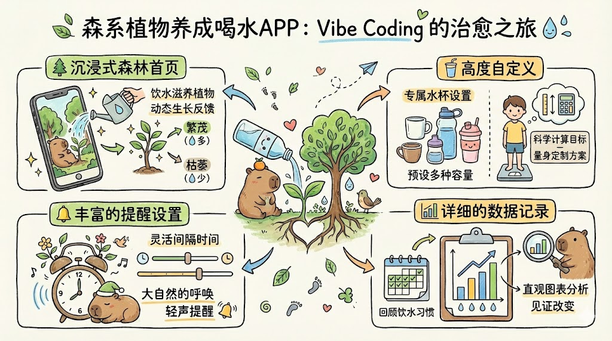

# ZaneHydrateMate（喝了么） - 沉浸饮水助手

> "Vibe Coding" 出的一款温暖的饮水提醒 APP。

##  初心 (Motivation)

作为一个经常忙起来就忘乎所以的人，我发现自己喝水非常不规律，经常一天下来滴水未进。这种生活状态显然是不健康的。

与其被动等待口渴，不如自己动手做一个有趣的工具。于是，我决定用 "Vibe Coding" 的方式开发这款 APP。它不仅仅是一个简单的闹钟，我希望通过一种更自然、更治愈的方式（森系植物养成），让自己爱上喝水，养成良好的健康习惯。

## 核心亮点 (Features)



这款 APP 融合了实用性与游戏化的乐趣，主要特点包括：

*   **🌲 沉浸式森林首页 (Immersive Forest):**
    *   拒绝枯燥的数字！你的每一次饮水都会滋养首页的植物。
    *   **动态生长反馈**：植物的状态会根据你当天的饮水目标完成率实时变化。喝水越多，森林越繁茂；长期缺水，植物也会枯萎哦。
*   **🥤 高度自定义 (Customization):**
    *   **自定义水杯**：预设多种容量的水杯，也支持添加你常用的专属杯子，记录更便捷。
    *   **科学计算目标**：根据你的身高、体重等个人信息，科学计算每日推荐饮水量，量身定制健康方案。
*   **🔔 丰富的提醒设置 (Smart Reminders):**
    *   支持灵活的提醒间隔和时间段设置。
    *   不仅提醒你喝水，更像是来自大自然的轻声呼唤。
*   **📊 详细的数据记录 (Stats):**
    *   直观的图表分析，帮你回顾每日、每周的饮水习惯，见证一点一滴的改变。

## 🛠️ 技术栈 (Tech Stack)

本项目基于现代前端技术栈构建，并使用 Capacitor 打包为移动端应用：

*   **Frontend:** React 19, Vite, TypeScript
*   **UI/Styling:** TailwindCSS, Radix UI, Framer Motion (动画)
*   **Icons:** Lucide React
*   **Charts:** Recharts
*   **Mobile:** Capacitor (Android), Local Notifications, SQLite (本地存储)
*   **Testing:** Vitest

## 🚀 快速开始 (Getting Started)

如果你也想运行或参与开发这个项目：

1.  **安装依赖:**
    ```bash
    cd frontend
    npm install
    ```

2.  **启动开发服务器:**
    ```bash
    npm run dev
    ```

3.  **构建并同步到 Android:**
    ```bash
    npm run build
    npx cap sync
    npx cap open android
    ```


---
Made with ❤️ by Zane
